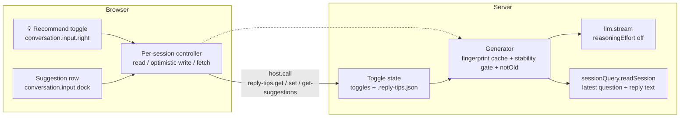
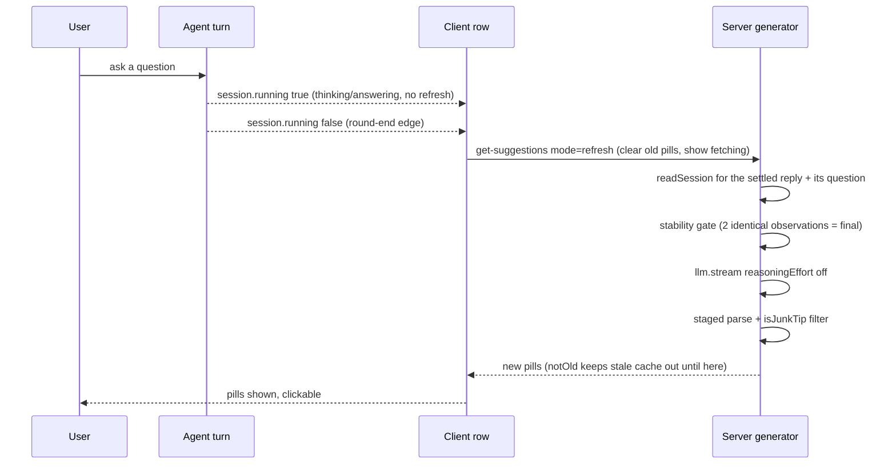

# reply-tips

[English](README.md) | [中文](README.zh.md)

A teaching example of a **client (browser) and server (Node) pair acting together**. A `💡 Recommend`
toggle (off by default) sits beside the send button; turning it on surfaces a row
above the chat input with **clickable follow-up pills that the LLM generates on
the fly from the latest user question and the assistant answer**. Clicking a pill
sends it. It is the next step after grill-send-button (pure client-side), practising
the full chain where the button lives in the browser while state and model calls
live on the server side.

## Architecture at a glance



| Role | Where | Job |
| --- | --- | --- |
| Client (browser) components | two browser slots | render and click; never the source of truth |
| controller | one per session in the browser | read toggle, optimistic write, fetch pills, subscribe |
| Server state | Node memory + file | single source of truth for the toggle, persisted to `.reply-tips.json` |
| Server generator | Node | pair → gate → generate → filter → cache |

## One refresh, step by step



| Stage | What it does | Why |
| --- | --- | --- |
| Edge trigger | fetch on the `session.running` true→false edge | the composer input machine only tracks your own submission, not the turn end |
| Stability gate | generate only after two identical observations of the reply | no premature pills while thinking/streaming |
| Clear then fetch | edge clears old pills and shows "fetching…" | the visible feedback is "switching", not stale content |
| `notOld` | no path may return the stale cache before the new batch lands | stops the old pills flashing back after a clear |
| Cheap generation | `reasoningEffort: 'off'` + maxTokens 8000 | the JSON-only task needs no thinking; fixes empty output from reasoning burning the budget |

## The three RPCs

| method | input | output | called when |
| --- | --- | --- | --- |
| `reply-tips.get` | `{ sessionId }` | `{ enabled }` | component mount reads the toggle |
| `reply-tips.set` | `{ sessionId, enabled }` | `{ enabled, saved }` | toggle click (optimistic + persist) |
| `reply-tips.get-suggestions` | `{ sessionId, mode: 'refresh'\|'poll' }` | `{ suggestions, reason, state }` | refresh on the round-end edge; 800 ms fallback poll |

`state` is `fresh` / `generating` / `idle`. `refresh` returns `generating` while
the reply is not settled yet, keeping the "fetching" state; `poll` may return the
stale cache only in steady state when no refresh is in progress.

## Directory structure

```
reply-tips/
├── src/index.ts               # pure-function layer, readable and testable
├── tests/reply-tips.spec.ts   # plain Node vitest, 29 cases green
├── dynamic/code.host.js       # server-side runtime (verified final version)
├── dynamic/code.client.js     # client-side runtime (verified final version)
├── DESIGN.md                  # design document (revision note on top governs)
└── README.md / README.zh.md   # this file
```

The pure functions in `src/index.ts` behave like the inlined copies inside
`dynamic/*`; host-coupled pieces stay in the runtime body.

## How to reproduce

### Step 1 — plain Node tests (no browser)

```sh
cp -r examples/reply-tips ../deepseek-harness/examples/reply-tips
cd ../deepseek-harness
pnpm exec vitest run --config examples/reply-tips/vitest.examples.config.ts examples/reply-tips
```

### Step 2 — dynamic repro in a running GUI

You first need a session that can reach the cordis tools. Either path:

| Path | How | Note |
| --- | --- | --- |
| A canonical | start a new GUI session with the 创造模式 preset (id `cordis`) | cordis tools come with the preset, no changes needed |
| B temporary | insert `@deepseek-ai/dsh-tool-cordis` into the web profile's `cordis.patch.yml` | the profile has `patchReload: live`, so it hot-mounts; revert afterwards (this widens the tools to ambient) |

Then, with the contents of `dynamic/code.host.js` and `dynamic/code.client.js`
as the payloads:

```text
1. cordis_define
   plugin.kind  "new"   idPrefix "rtip"
   name  "reply-tips dynamic"
   purpose  "adds a Recommend toggle and an LLM-suggested follow-up row"
   code.host    = whole dynamic/code.host.js
   code.client  = whole dynamic/code.client.js
   note the returned pluginId / packageId
2. cordis_run   pluginId / packageId / mode "run"
3. approve in the GUI (a dynamic client run needs a human approval)
4. the 💡 Recommend toggle appears beside the send button; turn it on
5. run the checklist below
6. cleanup  cordis_stop pluginId  →  cordis_undefine pluginId
```

Both payloads are plain-JS async function bodies that must `return` a plugin —
no TS, JSX or imports; React, `host` and `harness` are injected as symbols.

### Step 3 — verification checklist

- [ ] the instant the answer finishes, the old pills clear and "fetching…" shows
- [ ] new pills replace them directly, with no stale flash-back
- [ ] nothing refreshes while the model is still thinking — only after the reply settles
- [ ] pills are proper follow-ups, no bare tokens, JSON leftovers or generic filler
- [ ] clicking a pill sends it through the composer path; pills are disabled while a message is in flight
- [ ] a topic switch is followed because the reply fingerprint changed

## Mechanism map (problem → mechanism → guarantee)

| Problem | Mechanism | Guarantee |
| --- | --- | --- |
| listEvents carries no content | `readSession` reads the full log | you reach `data.message.content` |
| replies include reasoning | join only `text` blocks | the model sees clean reply text |
| pills during thinking | stability gate + running edge | generate only when final |
| old pills flash back after a clear | server-side `notOld` flag | stale cache stays out until the new batch lands |
| empty output / max-tokens | `reasoningEffort:'off'` + 8000 budget | reasoning no longer eats the budget |
| bare tokens become pills | `isJunkTip` at every parse exit | `]`, `{…}` leftovers are dropped |
| no timer on the client half | `inject:['timer']` + `ctx.timer.interval` | polling uses the service timer |
| handle result rejected | `null` instead of `undefined` for reason | `harness.handle` wants lossless JSON |

> The full 26-Package iteration log with root causes lives in
> `tmp-recon/reply-tips-dynamic/FINAL-2026-09-09.md`.

## Distribution

This directory is a teaching example, not an installable package. To ship it,
promote the runtime into a standard plugin package: the client side
into `packages/client/<name>/`, and the server side into a static package
with a service, session-log events, projection units and the `@Remote`
generated surface. `dynamic/*` serves as the behaviour-reference implementation
for that promotion.

## License

MIT, see [LICENSE](LICENSE).
