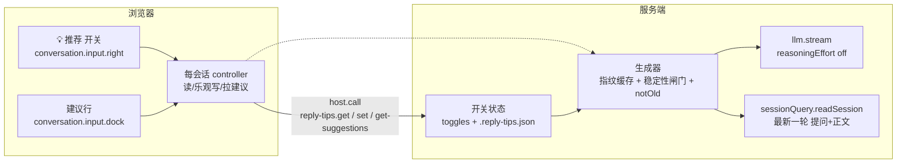
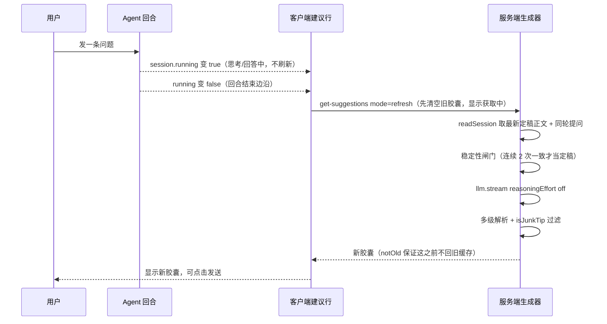

# reply-tips

[English](README.md) | 中文

一个 **客户端（浏览器）与服务端（Node）协同** 的教学 example。发送键旁加 `💡 推荐` 开关（默认关），开启后聊天框上方
出现一排可点的**追问胶囊**，由 LLM 按最新一轮问答现生成，点一条自动发送。它是 grill-send-button
（纯客户端插件）的下一个台阶，练「按钮在浏览器、状态与模型调用在服务端」的完整链路。

## 架构总览



| 角色 | 位置 | 职责 |
| --- | --- | --- |
| 客户端组件 | 浏览器两个槽 | 显示与点击，唯一真源不在它身上 |
| controller | 浏览器每会话一份 | 读开关、乐观写、拉建议、多组件订阅 |
| 服务端状态 | Node 内存 + 文件 | 开关唯一真源，`.reply-tips.json` 落盘 |
| 服务端生成器 | Node | 配对取数 → 闸门 → 生成 → 过滤 → 缓存 |

## 一次刷新是怎么发生的



| 阶段 | 做什么 | 为什么 |
| --- | --- | --- |
| 边沿触发 | `session.running` true→false 事件驱动拉取 | composer 输入机 phase 只描述你的消息提交，不代表回合结束 |
| 稳定性闸门 | 同一正文连续 2 次观测一致才生成 | 避开思考/流式中的半成品，杜绝提前出建议 |
| 清空再获取 | 边沿先清空旧胶囊再显示「获取中」 | 用户要的反馈是「在换新」而不是旧内容干挂 |
| `notOld` | 新一批落库前任何路径不回旧缓存 | 防止「清空后又闪回旧胶囊再被顶掉」 |
| 降本生成 | `reasoningEffort: 'off'` + maxTokens 8000 | JSON-only 任务不思考，根治预算被 reasoning 烧光的空输出 |

## 三个 RPC

| method | 入参 | 出参 | 何时调 |
| --- | --- | --- | --- |
| `reply-tips.get` | `{ sessionId }` | `{ enabled }` | 组件挂载读开关 |
| `reply-tips.set` | `{ sessionId, enabled }` | `{ enabled, saved }` | 点开关（乐观写 + 落盘） |
| `reply-tips.get-suggestions` | `{ sessionId, mode: 'refresh'\|'poll' }` | `{ suggestions, reason, state }` | 回合结束边沿 refresh；800ms 兜底 poll |

`state` 取 `fresh` / `generating` / `idle`。refresh 在未定稿时回 `generating` 保持「获取中」；poll 只在
没做刷新的稳态下才允许回旧缓存。

## 目录结构

```
reply-tips/
├── src/index.ts               # 纯函数层，可读可测
├── tests/reply-tips.spec.ts   # 纯 Node vitest，29 例全绿
├── dynamic/code.host.js       # 服务端侧运行体（实测最终版）
├── dynamic/code.client.js     # 客户端侧运行体（实测最终版）
├── DESIGN.md                  # 设计文档（顶部修订记录为本）
└── README.md / README.zh.md   # 本文件
```

`src/index.ts` 的纯函数与 `dynamic/*` 内联版行为一致，宿主耦合留在运行体内。

## 复现步骤

### 第一步，跑纯 Node 测试（不需要浏览器）

```sh
cp -r examples/reply-tips ../deepseek-harness/examples/reply-tips
cd ../deepseek-harness
pnpm exec vitest run --config examples/reply-tips/vitest.examples.config.ts examples/reply-tips
```

### 第二步，在运行中的 GUI 动态复现

前置条件是要一个**能拿到 cordis 工具**的会话，两条路任选：

| 路径 | 做法 | 备注 |
| --- | --- | --- |
| A 正规 | GUI 新会话预设选「创造模式」（id `cordis`） | cordis 工具随 preset 授予，无需改动 |
| B 临时 | 把 `@deepseek-ai/dsh-tool-cordis` 插进 web profile 的 `cordis.patch.yml` | profile 开 `patchReload: live` 热挂载；用完必须撤行（放宽成了全局工具） |

拿到工具后，以 `dynamic/code.host.js` 与 `dynamic/code.client.js` 文件内容为载荷：

```text
1. cordis_define
   plugin.kind  "new"   idPrefix "rtip"
   name  "reply-tips dynamic"
   purpose  "adds a Recommend toggle and an LLM-suggested follow-up row"
   code.host    = dynamic/code.host.js 全文
   code.client  = dynamic/code.client.js 全文
   记下返回的 pluginId / packageId
2. cordis_run   pluginId / packageId / mode "run"
3. 在 GUI 批准（动态 client 插件需要人批准）
4. 发送键旁出现 💡 推荐，点开即开启
5. 按下面的清单验证
6. 收尾  cordis_stop pluginId  →  cordis_undefine pluginId
```

两段载荷都是纯 JS async 函数体，必须 `return` 插件，无 TS/JSX/import，React、host、harness 由求值器注入。

### 第三步，验证清单

- [ ] 回答结束瞬间旧胶囊清空并显示「推荐问题获取中…」
- [ ] 新胶囊直接替换，中间不闪回旧内容
- [ ] 模型思考期间不提前刷新，正文定稿才触发
- [ ] 胶囊是像样的中文追问，没有裸符号、JSON 残片或「展开讲讲」这类废话
- [ ] 点胶囊经 composer 正路发送，消息在飞时胶囊禁用
- [ ] 换话题后胶囊跟随新回复

## 机制对照（问题 → 机制 → 保证）

| 问题 | 机制 | 保证 |
| --- | --- | --- |
| listEvents 没正文 | `readSession` 读完整事件 | 拿到 `data.message.content` |
| 回复含 reasoning | 只拼 `text` 块 | 喂给模型的正文干净 |
| 思考中就出建议 | 稳定性闸门 + running 边沿 | 定稿才触发 |
| 清空后又闪旧胶囊 | 服务端 `notOld` 标记 | 新批落库前不回旧缓存 |
| 空输出 / max-tokens | `reasoningEffort:'off'` + 8000 预算 | 不再把预算烧在思考上 |
| 裸符号当胶囊 | `isJunkTip` 过滤每级出口 | 不收 `]`、`{…}` 残片 |
| 客户端侧没有网页定时器 | `inject:['timer']` + `ctx.timer.interval` | 轮询有服务化定时器 |
| handle 返回报错 | 成功分支 reason 用 `null` | harness.handle 要求无损 JSON |

> 26 个 Package 的完整迭代与每个坑的根因，见 `tmp-recon/reply-tips-dynamic/FINAL-2026-09-09.md`。

## 分发

本目录是教学示例，不是可安装包。要分发就把运行体提升成标准插件包，客户端侧代码进
`packages/client/<name>/`，服务端侧按静态包做 service、session-log 事件、projection 与 `@Remote`
生成面。`dynamic/*` 可作为提升时行为对齐的参考实现。

## 许可

MIT，见 [LICENSE](LICENSE)。
