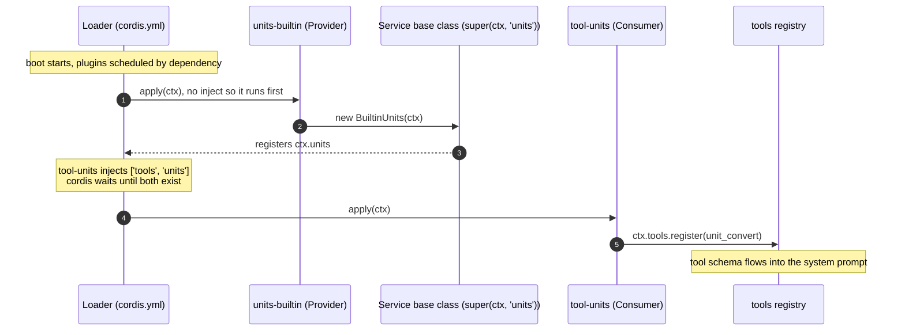
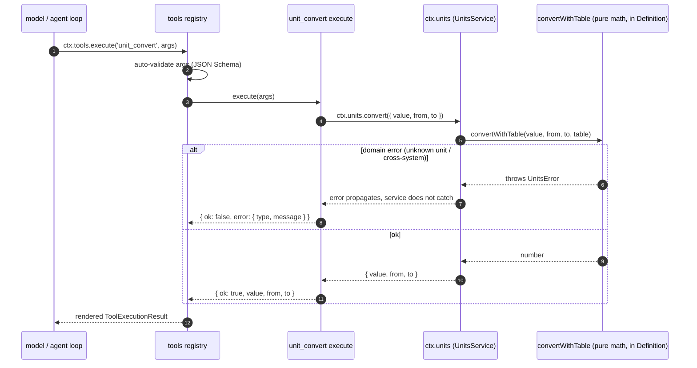

# units-capability example

English | [中文](README.zh.md)

A unit-conversion capability (`ctx.units`) split into three roles — a
Definition that owns the contract, a Provider that supplies the unit table,
and a Consumer tool the model calls. It shows how dsh plugins cooperate
**without importing each other**: everyone couples through one service key on
`ctx`, so swapping the provider row in `cordis.yml` changes the capability's
data without touching the tool.

## Running

This directory is the **source of truth** for the example. To run it, first
copy it into the deepseek-harness source's `examples/` (the copy over there may
be stale), then operate from the deepseek-harness root:

```sh
# 1. Copy into the deepseek-harness source (this repo is the source of truth)
cp -r examples/units-capability ../deepseek-harness/examples/units-capability

# 2a. Run the tests
cd ../deepseek-harness
pnpm exec vitest run examples/units-capability/tests/units-capability.spec.ts

# 2b. Or mount it into the web UI (temporary, via the patch layer)
pnpm dsh web --patch examples/units-capability/units.patch.yml
```

> Note: web HMR is disabled by default in release builds, so you must restart
> the web process after adding a plugin for the tool to appear.
>
> Note: an entry's `name` in a patch resolves against the **profile directory**
> (`~/.dsh/profiles/web/`), not against this file. `units.patch.yml` uses a
> relative path plus a junction under the profile directory; create the
> junction once before first use (Windows, no admin rights):
>
> ```sh
> cmd //c "mklink /J %USERPROFILE%\.dsh\profiles\web\examples <deepseek-harness>\examples"
> ```
>
> To avoid junctions, switch to an absolute `file:///` URL (rules at the top
> of that file; a DSH_HOME-on-same-drive relative hop and bundle install are
> the other two alternatives).

In the web UI, ask the model something like *"convert 5 km to mi"* — the model
calls `unit_convert` and receives the structured result
(`{ ok: true, value, from, to }`).

## Design

Plugins in dsh never import each other; they couple through flat service keys
on `ctx`. A capability is therefore a **seam with three roles**:

- **Definition** (`units/`) — the contract. It owns the service key
  (`declare module '@deepseek-ai/cordis'` augments `Context` with
  `units: UnitsService`), the Request/Result types, the structured
  `UnitsError`, and the pure conversion math `base = (value + offset) * factor`.
  It has no `apply` and never enters the composition tree — it is a plain
  library that providers and consumers import directly.
- **Provider** (`units-builtin/`, `units-custom/`) — the data. Each subclasses
  the abstract `UnitsService`; the `Service` constructor (`super(ctx, 'units')`)
  is what registers the subclass as `ctx.units`. The built-in provider ships a
  static table (length / mass / temperature / data); the custom provider loads
  its table from plugin config via a `Config` schema. Because the math lives in
  the Definition, a provider carries no logic of its own — swapping the row in
  `cordis.yml` changes only the table.
- **Consumer** (`tool-units/`) — the model-facing tool. It declares
  `inject = ['tools', 'units']` and delegates to `ctx.units.convert`. Domain
  errors (`UnitsError`) become canonical `{ ok: false, error }` values, never
  throws.

> **Deeper: how does `super(ctx, 'units')` register the service?**
>
> The `Service` base-class constructor (`vendor/cordis/src/service.ts`) calls
> `ctx.reflect.provide(name, this)` — that single call is what makes
> `ctx.units` exist. Subclassing `UnitsService` and constructing it inside the
> provider's `await ctx.plugin(BuiltinUnits)` is therefore the whole
> registration; there is no separate "register" call. It also explains the
> namespace rule below: the key is a flat global namespace, one owner per
> context, so a second provider throws `service "units" has been registered`.

Rules that fall out of this split:

- **Service keys are a flat global namespace.** One context can hold only one
  provider per key; loading a second throws cordis' standard
  `service "units" has been registered` error. The alternative provider in
  `cordis.yml` is a **swap** (comment it in, take the built-in out), not an
  addition.
- **An unawaited nested plugin fiber swallows errors.** The provider's `apply`
  must `await ctx.plugin(BuiltinUnits)`; skipping the await makes a duplicate
  provider fail silently.
- **Loading order follows dependencies, not file order.** The tool's `inject`
  makes cordis wait for `tools` and `units`, so the provider row does not have
  to precede the tool row in `cordis.yml` (it is written that way for
  readability).
- **The tool's schema still flows into the system prompt for free.** As with
  any `ctx.tools` registration, `unit_convert`'s name / description / parameters
  are assembled into the model's system prompt by `dsh-system-prompt`.

## Loading and runtime flow

Two sequence diagrams make the three roles concrete: how the composition
**boots** (provider registers the service, consumer waits for it) and how a
model call **flows** through the seam at runtime.

### Loading, who registers what and in what order



Note the Definition (`units/`) does **not** appear in this diagram, because it
has no `apply` and never enters the composition tree. It is a plain library
imported by the provider and the consumer — the contract is just there, it does
not "load". The custom provider (`units-custom/`) follows the exact same path;
only its table comes from config instead of a constant.

### Runtime, what happens when the model calls the tool



The consumer's `execute` is the only place that catches `UnitsError` — the
service layer lets it propagate (a domain error, not an infrastructure
failure) — and the tool maps it to a canonical `{ ok: false, error }` result,
never a throw.

## How to develop

```
units-capability/
├── units/src/index.ts            # Definition: abstract UnitsService + convertWithTable + types (no apply)
├── units-builtin/src/index.ts    # Provider: built-in unit table (length/mass/temperature/data)
├── units-custom/src/index.ts     # Provider: same seam, table from plugin config
├── tool-units/src/index.ts       # Consumer: unit_convert tool (inject: ['tools', 'units'])
├── tests/units-capability.spec.ts # 10 cases, real ToolRuntime + SystemPrompt
├── cordis.yml                    # composition: ONE provider + the tool; swap the provider row to change data
└── units.patch.yml               # web overlay entry
```

> Relationship note: this directory is the complete source + test package for
> the `ctx.units` capability; `notes/2026-08-22-units-capability.md` records
> the learning notes behind it.

- `units/src/index.ts` — the abstract `UnitsService extends Service`; its
  constructor is what registers the service under the `units` key. Providers
  implement `list()` and `convert()`. `convertWithTable` is the shared pure
  math: `base = (value + offset) * factor` means a linear unit is just
  `offset: 0`, and affine systems (temperature C/F) fall out of the same
  formula.
- `units-builtin/src/index.ts` — `export const BUILTIN_TABLE` plus a thin
  `UnitsService` subclass; `apply` awaits `ctx.plugin(BuiltinUnits)`.
- `units-custom/src/index.ts` — the same subclass pattern, but the table comes
  from `Config` (a Schemastery schema mirroring `UnitInfo`). Loading it after
  the built-in provider throws the duplicate-service error — the test asserts
  this loud failure.
- `tool-units/src/index.ts` — `defineTool` for `unit_convert`; `execute` calls
  `ctx.units.convert` and maps `UnitsError` to
  `{ ok: false, error: { type, message } }`. `presentCall` / `presentResult`
  stay pure (they must survive session-log replay).
- `tests/units-capability.spec.ts` — mounts the real `SystemPrompt` +
  `ToolRuntime`, ONE provider, and the consumer tool; executes through
  `ctx.tools.execute()` (the same boundary as the agent loop). The provider
  argument is the seam under test: the same tool serves the built-in table and
  a config-supplied custom table (including affine temperature offsets) with
  zero tool changes. Ten cases cover the contract and math, both providers,
  tool behavior, error canonicalization, automatic validation, the
  duplicate-provider loud failure, presenter purity, and Loader-safe exports.

Run the tests:

```sh
pnpm exec vitest run examples/units-capability/tests/units-capability.spec.ts
```

## How to ship

Same path as the other examples: this directory is a **teaching example**, not
an installable package. To distribute it, promote it to a standard bundle under
`packages/` following the
[packaging tutorial](../../docs/user/develop/basic/publish.md), then install
with `dsh plugin --profile <name> add <package>`. The Definition ships as part
of each bundle (or as its own package) — providers and the consumer import it
directly.
