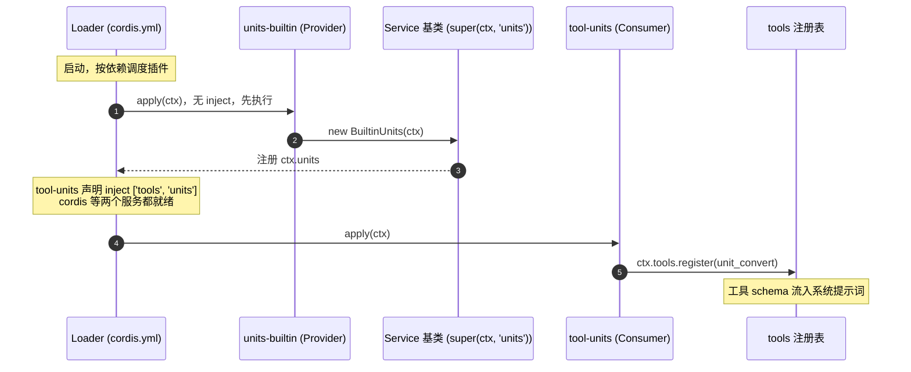
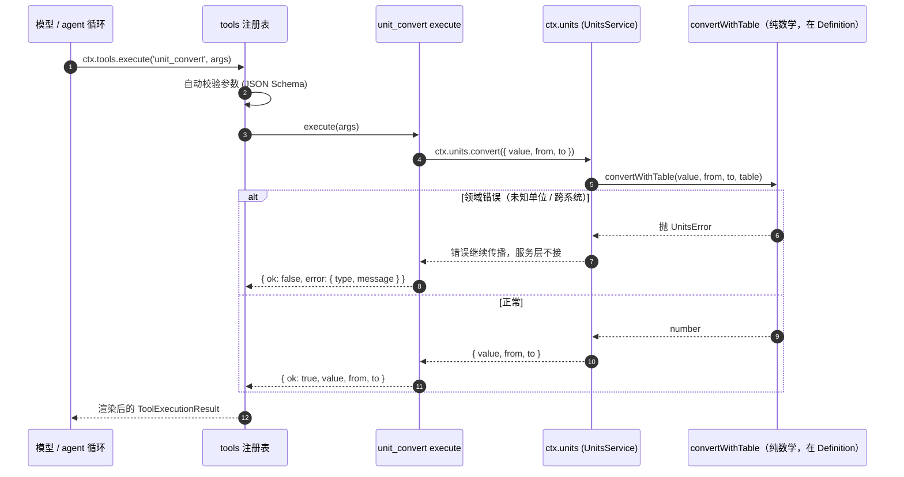

# units-capability 实战

[English](README.md) | 中文

一个「单位换算」能力（`ctx.units`）拆成三个角色：Definition 管契约、Provider 管数据、面向模型的 Consumer 工具管消费。它演示 dsh 插件如何**不互相 import**——所有人只通过 `ctx` 上的一个服务键协作，所以换掉 `cordis.yml` 里的 provider 行就能换数据，工具一个字都不用改。

## 运行

本目录是实战源码的**权威来源**。要运行，先把它拷贝到 deepseek-harness 源码的 `examples/`（那边的副本可能过期），再在 deepseek-harness 根目录操作：

```sh
# 1. 拷贝到 deepseek-harness 源码（本仓库是权威来源）
cp -r examples/units-capability ../deepseek-harness/examples/units-capability

# 2a. 跑测试
cd ../deepseek-harness
pnpm exec vitest run examples/units-capability/tests/units-capability.spec.ts

# 2b. 或挂进 web UI（临时，走 patch 层）
pnpm dsh web --patch examples/units-capability/units.patch.yml
```

> 注意：web 的 HMR 在发布版默认禁用，加新插件后必须重启 web 进程工具才会出现。
>
> 注意：patch 里 entry 的 `name` 是相对**profile 目录**（`~/.dsh/profiles/web/`）解析的，不是相对本文件。`units.patch.yml` 用的是相对路径 + profile 目录下的 junction；首次使用前建一次 junction（Windows，无需管理员权限）：
>
> ```sh
> cmd //c "mklink /J %USERPROFILE%\.dsh\profiles\web\examples <deepseek-harness>\examples"
> ```
>
> 不想用 junction，就改成绝对 `file:///` URL（规则见该文件顶部注释；同盘设 DSH_HOME 相对跳转和 bundle 安装是另外两种做法）。

在 web 界面里让模型做类似 *"convert 5 km to mi"* 的事——模型会自主调用 `unit_convert`，拿到结构化结果（`{ ok: true, value, from, to }`）。

## 设计

dsh 里插件互不 import，只通过 `ctx` 上扁平的服务键耦合。所以一个能力天然是**一条带三个角色的缝**：

- **Definition（`units/`）——契约**。它拥有服务键（`declare module '@deepseek-ai/cordis'` 给 `Context` 追加 `units: UnitsService`）、Request/Result 类型、结构化 `UnitsError`，以及纯换算数学 `base = (value + offset) * factor`。它没有 `apply`，永远不会进组合树——只是个普通库，Provider 和 Consumer 直接 import 它。
- **Provider（`units-builtin/`、`units-custom/`）——数据**。各自继承抽象类 `UnitsService`，靠 `Service` 构造器（`super(ctx, 'units')`）把自己注册成 `ctx.units`。内置 provider 带一张静态表（长度/质量/温度/数据）；自定义 provider 通过 `Config` schema 从插件配置读表。因为数学在 Definition 里，provider 自身不带任何逻辑——换 `cordis.yml` 里的行只换表。
- **Consumer（`tool-units/`）——面向模型的工具**。声明 `inject = ['tools', 'units']`，直接委托 `ctx.units.convert`。领域错误（`UnitsError`）变成 canonical 的 `{ ok: false, error }`，绝不 throw。

> **深入：`super(ctx, 'units')` 是怎么注册服务的？**
>
> `Service` 基类构造器（`vendor/cordis/src/service.ts`）会调 `ctx.reflect.provide(name, this)`——就这一行让 `ctx.units` 存在。所以继承 `UnitsService` 并在 provider 的 `await ctx.plugin(BuiltinUnits)` 里构造它，就是注册的全部，没有单独的 register 调用。这也解释了下面的命名空间规则：键是扁平全局命名空间，一个 ctx 一个拥有者，第二个 provider 直接抛 `service "units" has been registered`。

这套拆分带出的规则：

- **服务键是扁平全局命名空间。** 一个 ctx 里每个键只能有一个 provider；再加载第二个会抛 cordis 标准的 `service "units" has been registered` 错误。`cordis.yml` 里注释掉的备选 provider 是**换**（注释进去、把内置的注释掉），不是加。
- **未 await 的嵌套插件 fiber 会吞错误。** provider 的 `apply` 必须 `await ctx.plugin(BuiltinUnits)`；漏了 await，重复 provider 会静默失败。
- **加载顺序由依赖决定，不是文件顺序。** 工具的 `inject` 让 cordis 等齐 `tools` 和 `units` 才加载它，所以 provider 行不必写在 tool 行前面（写在前只是为了可读性）。
- **工具的 schema 照样免费进系统提示词。** 和任何 `ctx.tools` 注册一样，`unit_convert` 的 name / description / parameters 由 `dsh-system-prompt` 装配进模型的系统提示词。

## 加载与运行时序

两张时序图把三个角色落到「动起来」的样子：组合**启动**时谁注册什么、谁等谁，以及模型调用时调用链**怎么走**。

### 加载，谁注册什么、什么顺序



注意 Definition（`units/`）**没有**出现在这张图里，因为它没有 `apply`，永远不会进组合树。它就是被 Provider 和 Consumer import 的普通库，契约一直在那，不需要「加载」。自定义 provider（`units-custom/`）走的是完全一样的路径，只是表来自配置而不是常量。

### 运行时，模型调用工具时发生了什么



Consumer 的 `execute` 是唯一接住 `UnitsError` 的地方——服务层让它继续传播（这是领域错误，不是基础设施故障）——工具把它映射成 canonical 的 `{ ok: false, error }`，绝不 throw。

## 怎么开发

```
units-capability/
├── units/src/index.ts            # Definition：抽象 UnitsService + convertWithTable + 类型（无 apply）
├── units-builtin/src/index.ts    # Provider：内置单位表（长度/质量/温度/数据）
├── units-custom/src/index.ts     # Provider：同一条缝，表来自插件配置
├── tool-units/src/index.ts       # Consumer：unit_convert 工具（inject: ['tools', 'units']）
├── tests/units-capability.spec.ts # 10 个用例，真实 ToolRuntime + SystemPrompt
├── cordis.yml                    # 组合：一个 provider + 工具；换 provider 行即换数据
└── units.patch.yml               # web overlay 入口
```

> 关系说明：本目录是 `ctx.units` 能力的完整源码 + 测试包；`notes/2026-08-22-units-capability.md` 记录它背后的学习心得。

- `units/src/index.ts` — 抽象类 `UnitsService extends Service`，构造器（`super(ctx, 'units')`）就是注册服务的地方。Provider 实现 `list()` 和 `convert()`。`convertWithTable` 是共享的纯数学：`base = (value + offset) * factor` 意味着线性单位就是 `offset: 0`，仿射系统（温度 C/F）也由同一公式自然覆盖。
- `units-builtin/src/index.ts` — `export const BUILTIN_TABLE` + 一个很薄的 `UnitsService` 子类；`apply` 里 `await ctx.plugin(BuiltinUnits)`。
- `units-custom/src/index.ts` — 同样的子类套路，但表来自 `Config`（镜像 `UnitInfo` 的 Schemastery schema）。在内置 provider 之后再加载它就会抛重复服务错误——测试专门断言了这种「响亮的失败」。
- `tool-units/src/index.ts` — `defineTool` 定义 `unit_convert`；`execute` 调 `ctx.units.convert`，把 `UnitsError` 映射成 `{ ok: false, error: { type, message } }`。`presentCall` / `presentResult` 保持纯函数（它们要扛住会话日志重放）。
- `tests/units-capability.spec.ts` — 挂真实 `SystemPrompt` + `ToolRuntime`、一个 provider、consumer 工具，经 `ctx.tools.execute()` 执行（与 agent 循环同一入口）。provider 参数就是被测的接缝：同一个工具，零改动地服务内置表和配置注入的自定义表（含仿射温度偏移）。10 个用例覆盖契约与数学、两个 provider、工具行为、错误 canonical 化、自动校验、重复 provider 响亮失败、presenter 纯度、Loader 安全导出。

跑测试：

```sh
pnpm exec vitest run examples/units-capability/tests/units-capability.spec.ts
```

## 怎么分发

与其他实战一致：本目录是**教学示例**，不是可安装包。要分发，按[打包教程](../../docs/user/develop/basic/publish.md)升级成 `packages/` 下的标准 bundle，再用 `dsh plugin --profile <name> add <package>` 安装。Definition 随各 bundle（或作为独立包）一起分发——Provider 和 Consumer 直接 import 它。
